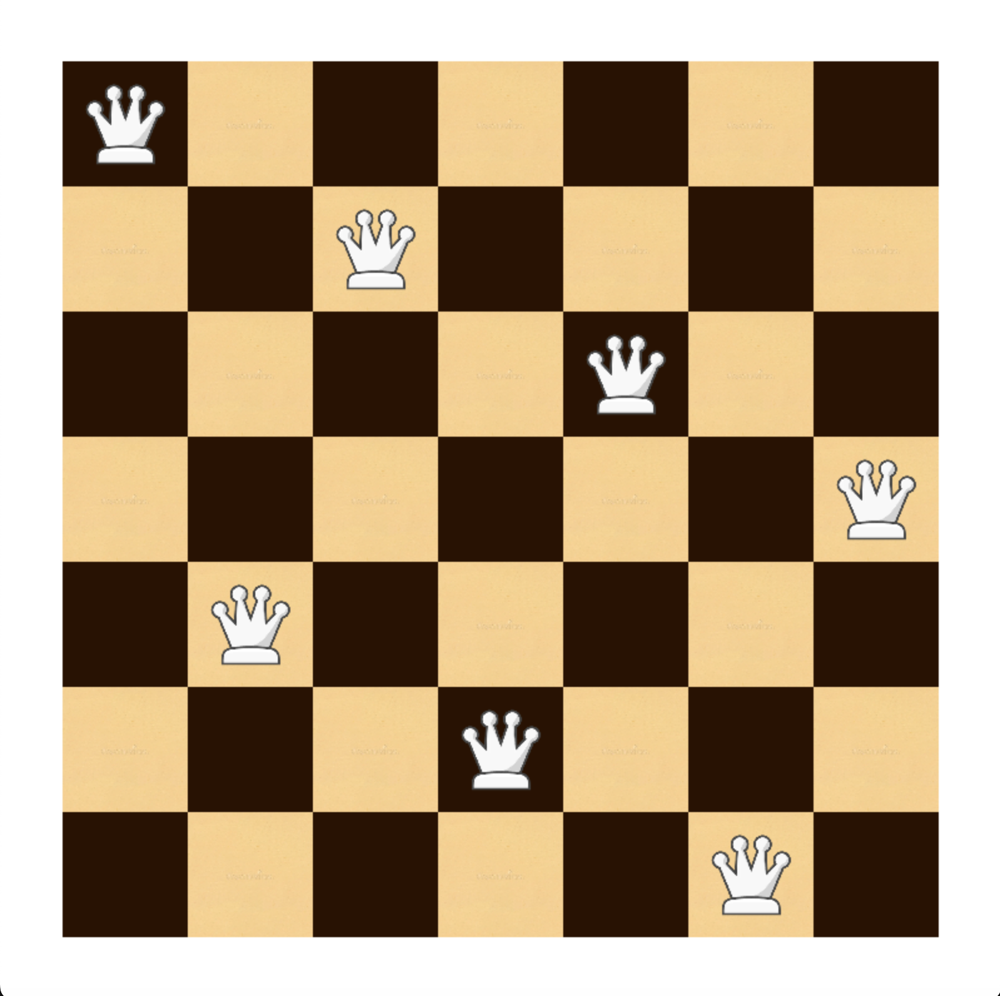

# N-Queens Visualizer (Python + Pygame)

## Overview

This project implements a visual solution to the **N-Queens problem** using Python.  
It combines a **backtracking algorithm** with a **Pygame-based graphical interface** to display a valid arrangement of queens on an `n × n` chessboard such that no two queens attack each other.

The program computes a solution algorithmically and then renders the board and queen placements visually.

---

## The N-Queens Problem

The N-Queens problem asks:

> Can `n` queens be placed on an `n × n` chessboard so that no two queens share the same row, column, or diagonal?

This project solves the problem using **recursive backtracking**, checking column and diagonal constraints at each step to prune invalid placements.

---

## Features

- Backtracking-based N-Queens solver
- Graphical chessboard rendering using Pygame
- Scales automatically for different board sizes (`n`)
- Clear visualization of queen placements
- Modular structure separating logic and GUI

## How It Works

### Algorithm (Backtracking)

1. Place one queen per row.
2. Try all columns in the current row.
3. After placing a queen, check:
   - Same column
   - Left diagonal (`\`)
   - Right diagonal (`/`)
4. If the position is valid, recurse to the next row.
5. If a conflict occurs, backtrack and try a new column.
6. The process continues until a full solution is found or all possibilities are exhausted.

---

### GUI Rendering

- The board is drawn dynamically based on `n`.
- Alternating square colors create a chessboard pattern.
- Queens are scaled to fit each square.
- Once a solution is found, queens are displayed at their correct positions.

---

## Requirements

- Python 3.x
- Pygame

## Screenshot

### Solved N-Queens Board

